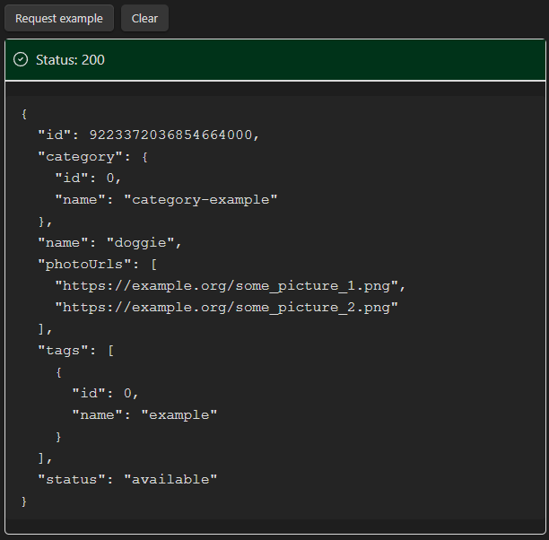

# Obsidian request sender Plugin

This is a request sender plugin for Obsidian (https://obsidian.md).

This project allows to add buttons on Obsidian notes that will send REST requests and display the request's response.



## How to use

Add block code with the request parameters:

``` request-sender
title: <Button title>
type: GET | POST | PUT | DELETE
url: <Requst URL>
headers: <[Optional] Request headers>
body: <[Optional] Request body>
formData: <[Optional] Request form data>
```

Note: parameters must respect YAML format.

## Examples


Simple GET request:


``` request-sender
title: Example GET
type: GET
url: https://petstore.swagger.io/v2/pet/findByStatus?status=available
```


POST request with body:


``` request-sender
title: Example POST body
type: POST
url: https://petstore.swagger.io/v2/pet
headers:
  Content-type: application/json
body: >
  {
    "id": 0,
    "category": {
      "id": 0,
      "name": "category-example"
    },
    "name": "doggie",
    "photoUrls": [ "https://example.org/some_picture_1.png", "https://example.org/some_picture_2.png" ],
    "tags": [
      {
        "id": 0,
        "name": "example"
      }
    ],
    "status": "available"
  }
```


PUT request with XML data:


``` request-sender
title: Example PUT with XML data
type: PUT
url: https://petstore.swagger.io/v2/pet/
headers:
  Content-type: application/xml
body: > 
  <?xml version="1.0" encoding="UTF-8"?>
  <Pet>
  	<id>0</id>
  	<Category>
  		<id>0</id>
  		<name>string</name>
  	</Category>
  	<name>doggie</name>
  	<photoUrls>
  		<photoUrl>string</photoUrl>
  	</photoUrls>
  	<tags>
  		<Tag>
  			<id>0</id>
  			<name>string</name>
  		</Tag>
  	</tags>
  	<status>available</status>
  </Pet>
```